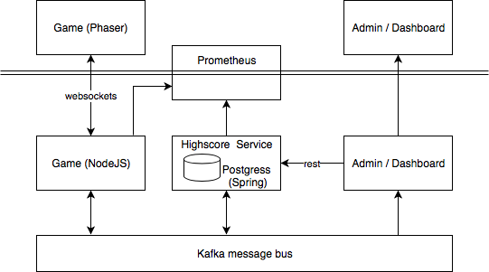
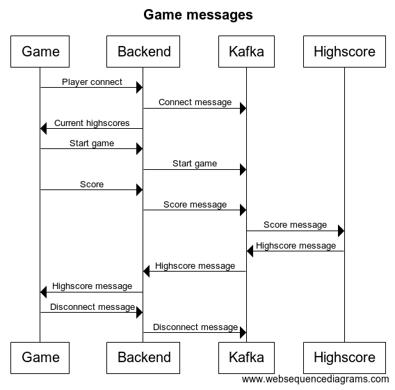

# HCS Company - Red Hat Forum 2018 Demo

This repository contains a small game and some additional services to demonstrate the power of OpenShift.

To start-up the development environment:

```bash
docker-compose up
```

Note that the front-end might fail to start with a 'unknown topic' error. This can be work-around by adding a score using the highscore rest api first (see highscore/README.md) and then ```docker-compose restart frontend```.

## Architecture

The architecture of the demo is as below:


The demo uses messaging as illustrated the below sequence diagram:


### Kafka message bus

The Kafka message bus is used to distribute all events that occur during the gameplay to all running services that require this. Typically there are two types of messages used by this system:

* transaction - e.q. when a new score should be registered
* broadcast - e.g. when a new highscore table is available

The broadcast is a publish subscribe pattern, transaction messages that are send should be consumed only once (even if multiple services are running). In Kafka, if a message should be consumed only once, the consumers that read this topic should be placed in the same ConsumerGroup.

The following topics are used, and messages send to these topics are formatted in json.

* connect
* disconnect
* score
* highscore

#### Topic: connect and disconnect

Each time a player connects to the webserver via a websocket, a message is
published to the ```connect``` topic. This message contains ```playerId```, ```name``` and the personal ```highscore``` of the player that connected. When the player disconnects, the same message is send to the ```disconnect``` topic. Note that the ```highscore``` and ```name``` could differ as the player might have changed his nickname, or improved his personal best.

Example:
```json
{
    "highscore": 66,
    "id": "429a2224-72c5-4491-a3ab-4473325b0fb9",
    "name": "joyrex2001"
}
```

#### Topic: score

When the player finished the game, his score is published to the ```score``` topic. This message contains ```playerId```, ```name``` and his ```score```.

Example:
```json
{
    "name": "joyrex2001",
    "playerId": "429a2224-72c5-4491-a3ab-4473325b0fb9",
    "score": 21
}
```

#### Topic: highscore

The ```highscore``` topic contains the top-10 scores, ordered from highest to lower. Typically the game backend will read the last published message from the topic to bootstrap his highscore table. The highscore service will publish a new message to this topic when some change has occurred on the score table.

Example:
```json
[
    {
        "name": "joyrex2001",
        "score": 66
    },
    {
        "name": "joyrex2001",
        "score": 62
    },
    ...
]
```

### Game and frontend

The frontend folder contains the actual game and its backend. The game is heavily based on [Stack the crates](https://www.emanueleferonato.com/2017/12/22/play-stack-the-crates-html5-game-my-take-on-tipsy-tower-concept-source-code-available/). Also note that it uses a commercial phaser plugin [Box2D](https://phaser.io/shop/plugins/box2d).

The frontend communicates with the backend using websockets to send out the messages as indicated in the sequence diagram and the kafka section.

### Highscore service

The highscore service is a small service that listens to both a REST API as well as the Kafka message bus and is responsible for the administration of the scores. It uses a Postgres database to store the data.

### Prometheus

Both the highscore and frontend (game) services expose prometheus metrics. See the README.md in the source folders for more details about the endpoints.
